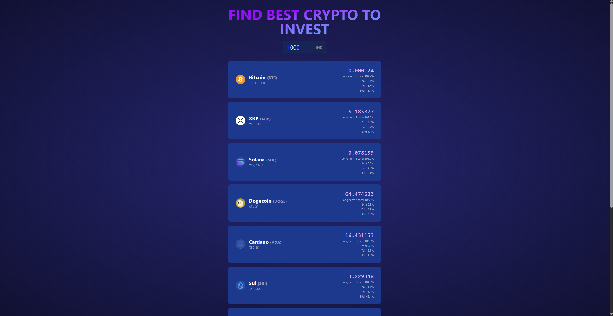

# Find Best Crypto to Invest

A modern React application that helps investors identify the best cryptocurrency investment opportunities based on comprehensive market analysis. The app fetches real-time data from CoinGecko API and displays the top cryptocurrencies with the best long-term investment potential.
## Live Demo
[LINK]](https://btc-price-tracker-faeiqkhans-projects.vercel.app/)
## Screenshot


## Features

- 💰 Real-time cryptocurrency price data from CoinGecko
- 📊 Comprehensive investment analysis including:
  - Market Cap
  - Trading Volume
  - Price Stability
  - Growth Potential
- 🎯 Shows top 10 best investment opportunities
- 💵 Dynamic INR input for investment amount
- 🖼️ Beautiful, responsive UI with Tailwind CSS
- ⚡ Fast performance with data caching

## Tech Stack

- React
- TypeScript
- Tailwind CSS
- CoinGecko API

## Getting Started

### Prerequisites

- Node.js (v14 or higher)
- npm or yarn

### Installation

1. Clone the repository:
```bash
git clone https://github.com/faeiqkhan/find-best-crypto-to-invest.git
cd find-best-crypto-to-invest
```

2. Install dependencies:
```bash
npm install
# or
yarn install
```

3. Start the development server:
```bash
npm start
# or
yarn start
```

4. Open [http://localhost:3000](http://localhost:3000) to view it in your browser.

## Project Structure

```
src/
├── App.tsx              # Main application component
├── AmountInput.tsx      # Input component for INR amount
├── OffersTable.tsx      # Table component showing crypto deals
├── coinApi.ts           # API utilities and data fetching
└── index.css           # Global styles and Tailwind imports
```

## How It Works

1. The user enters an INR amount they want to invest
2. The app fetches current market data for top 100 cryptocurrencies
3. Each coin is analyzed based on:
   - Market Cap (30% weight)
   - Trading Volume (20% weight)
   - Price Stability (20% weight)
   - Growth Potential (30% weight)
4. Coins are sorted by long-term investment score
5. Top 10 best opportunities are displayed with:
   - Coin image and name
   - Current price in INR
   - Quantity you can buy
   - Long-term investment score
   - Price changes (24h, 7d, 30d)

## API Usage

The app uses the CoinGecko API to fetch cryptocurrency data. The main endpoint used is:
```
GET https://api.coingecko.com/api/v3/coins/markets
```

Parameters:
- `vs_currency=inr`: Price in Indian Rupees
- `order=market_cap_desc`: Sorted by market cap
- `per_page=100`: Fetch top 100 coins
- `page=1`: First page of results
- `price_change_percentage=24h,7d,30d`: Get price changes

## Contributing

1. Fork the repository
2. Create your feature branch (`git checkout -b feature/AmazingFeature`)
3. Commit your changes (`git commit -m 'Add some AmazingFeature'`)
4. Push to the branch (`git push origin feature/AmazingFeature`)
5. Open a Pull Request

## License

This project is licensed under the MIT License - see the [LICENSE](LICENSE) file for details.

## Acknowledgments

- [CoinGecko API](https://www.coingecko.com/en/api) for providing cryptocurrency data
- [Tailwind CSS](https://tailwindcss.com/) for the styling system
- [React](https://reactjs.org/) for the frontend framework
